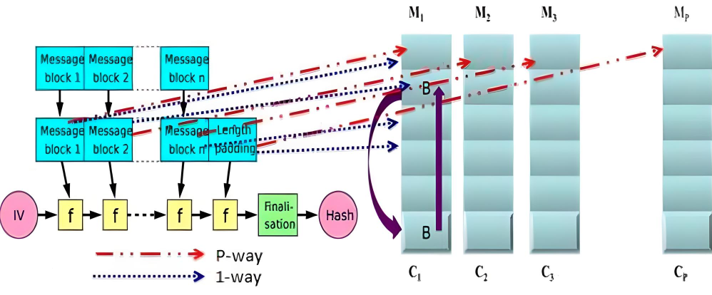
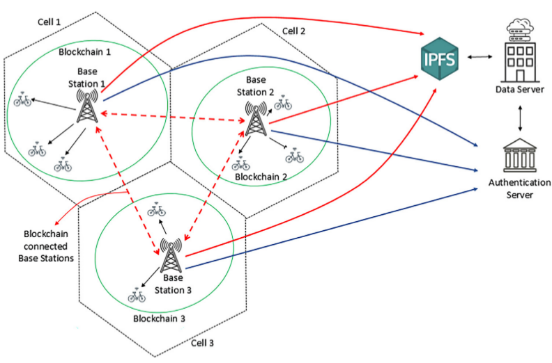
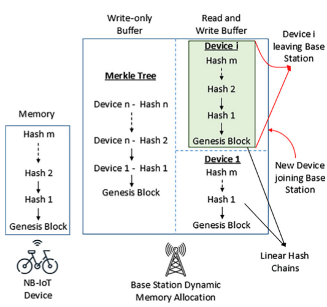
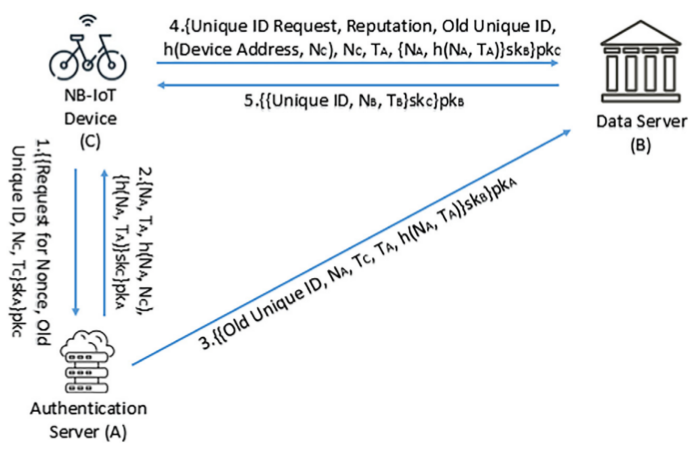
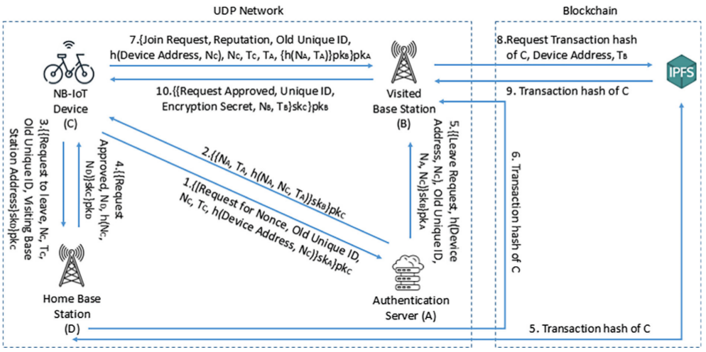
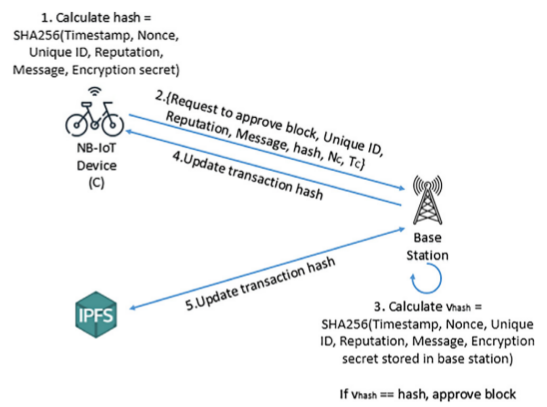

<h2 align="center"> NB-IoT Hbyrid Blockchain using ESHA-256 Algorithm </h2>

<p align="center">
  <a href="#Unique-ID-Generation"> Unique ID Generation </a> •
  <a href="#Device-Join-Procedure"> Device Join Procedure </a> •
  <a href="#Device-Transactions"> Device Transactions </a>
</p>

# Motivation
The goal of this study is to further save energy consumption by NB-IoT Framework in "Enabling secure lightweight mobile Narrowband Internet of Things (NB-IoT) applications using blockchain" by using the Energy Efficient SHA-256 (ESHA-256) algorithm.   

# ESHA-256
<p align="center">
</p>

ESHA-256 algorithm reduces the computational power required for running the SHA-256 algorithm by access message data from memory banks in parallel rather than sequentially, as shown in the above figure. 

<!--
<p>This section provides the statistical summary of the energy measurements of ESHA-256 Sequential/Parallel using pyRAPL (Python Running Average Power Limit).</p>

| Block Size | Bytes     | Sequential | Parallel  | Energy Savings |
|-------------|-----------|------------|-----------|----------------|
| 8           | 56        | 47,058     | 23,010    | -51%           |
| 800         | 5,600     | 41,260     | 25,696    | -38%           |
| 8,000       | 56,000    | 51,452     | 42,358    | -18%           |
| 80,000      | 560,000   | 134,339    | 115,478   | -14%           |
| 800,000     | 5,600,000 | 916,318    | 911,619   | -1%            |
| 8,000,000   | 56,000,000| 9,084,755  | 9,060,463 | 0%             |
-->
#
# ESHA-NB-IOT Framework
<p align="center">	  
  .....
</p>

* NB-IOT: devices are resource constrained with less computational power, low memory, storage and bandwidth. Therefore, devices only store hash of transactions initiated by them in an array as linear hash chain. By design, NB-IoT devices will have device address and reputation (default 4).
* BASE STATIONS: Transactions initiated by NB-IoT devices can only be authorized by base station using non-interactive ZKP and then added to blockchain. The base station dynamically partitions its memory to store device transactions in a merkle tree and allocate the rest to store individual device transactions in a linear hash chain for faster access.
* ETHEREUM BLOCKCHAIN: NB-IoT Devices and base stations are connected through ethereum blockchain using Remix IDE Smart Contracts. Non-interactive ZKP (HMAC) is used as consensus algorithm for block approval.
* AUTHENTICATION SERVER: The only responsibility of the authentication server is to authenticate NB-IoT devices using unique ID allocated to the device.
* DATA SERVER: is responsible for issuing Unique ID to NB-IoT devices.
* IPFS (Inter Planetary File System): connects base stations to provide decentralised data storage and sharing.

```bash
Non-Interactive Zero-Knowledge Proof: The prover verifies that it knows secret information without revealing what that information is. In digital signatures, prover can demonstrate knowledge of private key associated with public key, without revealing the private key itself.
```
<br/>

## Unique ID Generation 

* For anonymity, when NB-IoT device joins a new cell, the data server issues a 'New Unique ID' and 'Encryption Secret' to the device after authentication.
* The Unique ID is used as identifier in blockchain.
* IoT Devices are assigned ‘Device Address’ as permanent ID by the Data Server when they join blockchain for the first time. 
  
<p align="center">Seed = Old Unique ID | Encryption Secret | Nonce  <br/>Unique ID = UUID(random.getrandbits(Seed)</p>
<br/>
<p align="center">	  
  
</p>

# 
> **IoT Client**
```bash
$ python IoTClient.py
```
> Terminal Output
```bash
Sent tuple to Authentication Server (A): ('127.0.0.1', 1001) - ('NReq', '0x000000000000000a', '6148bf32701b7ddd20a1e7c4b4c052f3', '1721519301')

Received tuple from Authentication Server (A): ('127.0.0.1', 1001) - ('c718faeefcd166b2c1e90f0e08888c6d', '1721519280', '68AFF4353B8317BE24CA6096F19EA95D80DD992BA5F1E0C3F60C296EEE304BB3', '0BD471F807062F5CDA968C3CE14A00368AFE6939B63C985ABDE8A20E5CC93114')

Sent tuple to Data Server (B): ('127.0.0.2', 2002) - ('IDReq', '6', '0x000000000000000a', 'D1CDFB53D3FBD31372A5708DB39B7525AA8D8E0277C1A0BBAEF4589AF237A3D6', '6148bf32701b7ddd20a1e7c4b4c052f3', '1721519280', 'c718faeefcd166b2c1e90f0e08888c6d', '0BD471F807062F5CDA968C3CE14A00368AFE6939B63C985ABDE8A20E5CC93114')

Received tuple from Data Server (B): ('127.0.0.2', 2002) - ('0x00000000000000aa', '7a8253502d40e501662c91eb6c7e162b', '1721519264')

New Unique ID received from Data Server = 0x00000000000000aa

```
# 
> **Authentication Server**
```bash
$ python AuthenticationServer.py
```
> Terminal Output
```bash
Received tuple from IoT (C): ('127.0.0.1', 54044): ('NReq', '0x000000000000000a', '6148bf32701b7ddd20a1e7c4b4c052f3', '1721519301')

Sent tuple to IoT (C): ('127.0.0.1', 54044) - ('c718faeefcd166b2c1e90f0e08888c6d', '1721519280', '68AFF4353B8317BE24CA6096F19EA95D80DD992BA5F1E0C3F60C296EEE304BB3', '0BD471F807062F5CDA968C3CE14A00368AFE6939B63C985ABDE8A20E5CC93114')

Sent tuple to Data Server (B): ('127.0.0.2', 2002) - ('0x000000000000000a', 'c718faeefcd166b2c1e90f0e08888c6d', '1721519301', '1721519280', '0BD471F807062F5CDA968C3CE14A00368AFE6939B63C985ABDE8A20E5CC93114')

```
# 
> **Data Server**
```bash
$ python Dataserver.py
```
> Terminal Output
```bash
Received tuple from Authentication Server (A): ('127.0.0.1', 1001): ('0x000000000000000a', 'c718faeefcd166b2c1e90f0e08888c6d', '1721519301', '1721519280', '0BD471F807062F5CDA968C3CE14A00368AFE6939B63C985ABDE8A20E5CC93114')

Received tuple from IoT (C): ('127.0.0.1', 54044): ('IDReq', '6', '0x000000000000000a', 'D1CDFB53D3FBD31372A5708DB39B7525AA8D8E0277C1A0BBAEF4589AF237A3D6', '6148bf32701b7ddd20a1e7c4b4c052f3', '1721519280', 'c718faeefcd166b2c1e90f0e08888c6d', '0BD471F807062F5CDA968C3CE14A00368AFE6939B63C985ABDE8A20E5CC93114')

Sent tuple to IoT (C): ('127.0.0.1', 54044) - ('0x00000000000000aa', '7a8253502d40e501662c91eb6c7e162b', '1721519264')

```


---
<h3>Unique ID Generation - Statistical Summary (SHA-256 Sequential vs Parallel)</h3>

This section provides the statistical summary of the energy measurements and duration using pyRAPL (Python Running Average Power Limit).
#
> **IOT CLIENT**

| SEQUENTIAL | CPU  | DRAM  | Duration  |
|-----------|----------|----------|-------------|
| MEAN      | 135051 | 12523| 23940 |
| MEDIAN    | 130462      | 7386   | 11310     |

| PARALLEL | CPU  | DRAM  | Duration |
|-----------|----------|----------|-------------|
| MEAN      | 125495 | 9650 | 17977 |
| MEDIAN    | 122620   | 6287      | 10769     |


| PERCENTAGE %      | CPU   | DRAM  | Duration |
|--------------------|---------|---------|----------|
| MEAN      | -7      | -23     | -25     |
| MEDIAN    | -6      | -15     | -5      |


For raw data, refer to the
- [SHA-256 Sequential Access Measurement Details](./Device%20ID/IoT%20Client.csv)
- [SHA-256 Parallel Access Measurement Details](./Device%20ID/E-IoT%20Client.csv)
#
> **AUTHENTICATION SERVER**

| SEQUENTIAL       | CPU   | DRAM  | Duration |
|--------------------|---------|---------|----------|
| Mean      | 294,341| 35,980| 27,334|
| Median    | 263,977| 33,295| 26,609|
| Mode      | N/A    | 33,264| 25,935|

| PARALLEL    | CPU   | DRAM  | Duration |
|--------------------|---------|---------|----------|
| Mean      | 290,575| 36,936| 27,278|
| Median    | 264,007| 34,973| 26,498|
| Mode      | 285,705 249,511  286,986  260,742  254,821| 36,682 32,532|    |

| PERCENTAGE  %    | CPU   | DRAM  | Duration |
|--------------------|---------|---------|----------|
| Mean      | -1.28 | 2.66  | -0.21 |
| Median    | 0.01  | 5.04  | -0.42 |


For raw data, refer to the
- [SHA-256 Sequential Access Measurement Details](./Device%20ID/Authentication%20Server.csv)
- [SHA-256 Parallel Access Measurement Details](./Device%20ID/E-Authentication%20Server.csv)

#
> **DATA SERVER**

| SEQUENTIAL       | CPU   | DRAM  | Duration |
|--------------------|---------|---------|----------|
| Mean      | 294,859| 36,071| 27,434|
| Median    | 263,703| 33,142| 26,653|
| Mode      | 247,253| 33,142  255,859  242,980|   |

| PARALLEL    | CPU   | DRAM  | Duration |
|--------------------|---------|---------|----------|
| Mean      | 291,220| 36,996| 27,371|
| Median    | 264,343| 35,309| 26,358|
| Mode      | 252,685  252,929  240,356| 36,926  36,560  35,949  37,597 35,584 44,433  40,405 31,128   |   |

| PERCENTAGE  %    | CPU   | DRAM  | Duration |
|--------------------|---------|---------|----------|
| Mean      | -1.23 | 2.56  | -0.23 |
| Median    | 0.24  | 6.54  | -1.11 |


For raw data, refer to the
- [SHA-256 Sequential Access Measurement Details](./Device%20ID/Data%20Server.csv)
- [SHA-256 Parallel Access Measurement Details](./Device%20ID/E-Data%20Server.csv)

  
Measurement Units
- Energy Units (CPU, DRAM) = Microjoules
- Duration = Microseconds
---


<br/>

## Device Join Procedure

* (1-2) Authentication Server authenticates the NB-IoT device using its existing Unique ID.
* (3) After authentication, NB-IoT device sends 'Leave Request' to Home Base Station along with address of Visiting Base Station.
* (4-6) Home Base Station 'Approve' the request. Then, Base Station 'Saves' deployed Smart Contract along with transactions recorded in JSON format in Remix IDE. The file is then uploaded to Inter Planetary File System (IPFS) and resulting File Hash is shared with Visiting Base Station.
* (7-10) NB-IoT sends 'Join Request' to Visiting Base Station. Visiting Base Station downloads JSON file from IPFS, verifies IoT device using Unique ID and then sends 'New Unique ID' and 'Encryption Secret' to NB-IoT device. The New Unique ID and Encryption Secret is then used by Non-Interactive ZKP for block approval.

<p align="center">	  
  
</p>

# 
> **IoT Client**
```bash
$ python IoTClient.py
```
> Terminal Output
```bash
Sent tuple to Authentication Server (A) ('127.0.0.1', 1001) - ('NReq', '0x000000000000000a', '8e6e0aa746ccc38b3016f5b61bc5d48e', '1721520743', 'F2A2C96B931407AD2E6CC2D0348D76B8F98B6811D6F34A28BF664A17A8B2EAF5')

Received tuple from Authentication Server (A) ('127.0.0.1', 1001) - ('be8064004b62b6310e55f85600e4787e', '1721520729', '36F738E997A320DD386EBB8641E837C9250754848B4A6498193DBCBB5F325CC7')

Sent tuple to Home Base Station (D) ('127.0.0.3', 3003) - ('LReq', '8e6e0aa746ccc38b3016f5b61bc5d48e', '1721520743', '0x000000000000000a', '0x00000000000000bb')

Received tuple from Home Base Station (D) ('127.0.0.3', 3003) - ('RApp', 'eead184328e6c99f48b5115dc6ec3d21', '122F3DADE9419B3779DFE10A58C822664BEAF50A34117BED138B8DA60AB4637B')

Sent tuple to Visiting Base Station (B) ('127.0.0.2', 2002) - ('JReq', '6', '0x000000000000000a', 'F2A2C96B931407AD2E6CC2D0348D76B8F98B6811D6F34A28BF664A17A8B2EAF5', '8e6e0aa746ccc38b3016f5b61bc5d48e', '1721520743', '1721520729', 'F3C3732DCAF39CE4D5324A6180976D644C9158885E44FE6B685918B9D2F430DF')

Received tuple from Visiting Base Station (B) ('127.0.0.2', 2002) - ('RApp', '0x00000000000000aa', '0x0000000000000011', 'f0f9df22c2ac17ccb62abfb4d82a039c', '1721520697')

New Unique ID received from Visiting Base Station (B) = 0x00000000000000aa

```
# 
> **Authentication Server**
```bash
$ python Authentication.py
```
> Terminal Output
```bash
Received tuple from IoT (C): ('127.0.0.1', 50335): ('NReq', '0x000000000000000a', '8e6e0aa746ccc38b3016f5b61bc5d48e', '1721520743', 'F2A2C96B931407AD2E6CC2D0348D76B8F98B6811D6F34A28BF664A17A8B2EAF5')

Sent tuple to IoT (C): ('127.0.0.1', 50335) - ('be8064004b62b6310e55f85600e4787e', '1721520729', '36F738E997A320DD386EBB8641E837C9250754848B4A6498193DBCBB5F325CC7')

Sent tuple to Visiting Base Station Server (B): ('127.0.0.2', 2002) - ('LReq', 'A0E872F7AAF4D52155AF4AA6715F04B5B74A810710DA8F21CF378DAB20EF62D2', '0x000000000000000a', 'be8064004b62b6310e55f85600e4787e', '8e6e0aa746ccc38b3016f5b61bc5d48e')

```
# 
> **Home Base Station**
```bash
$ python HomeBS.py
```
> Terminal Output
```bash
Received tuple from IoT (C): ('127.0.0.1', 50335): ('LReq', '8e6e0aa746ccc38b3016f5b61bc5d48e', '1721520743', '0x000000000000000a', '0x00000000000000bb')

Sent tuple to IoT (C): ('127.0.0.1', 50335) - ('RApp', 'eead184328e6c99f48b5115dc6ec3d21', '122F3DADE9419B3779DFE10A58C822664BEAF50A34117BED138B8DA60AB4637B')

```
# 
> **Visiting Base Station**
```bash
$ python VisitingBS.py
```
> Terminal Output
```bash
Received tuple from Authentication Server (A): ('127.0.0.1', 1001): ('LReq', 'A0E872F7AAF4D52155AF4AA6715F04B5B74A810710DA8F21CF378DAB20EF62D2', '0x000000000000000a', 'be8064004b62b6310e55f85600e4787e', '8e6e0aa746ccc38b3016f5b61bc5d48e')

Received tuple from IoT (C): ('127.0.0.1', 50335): ('JReq', '6', '0x000000000000000a', 'F2A2C96B931407AD2E6CC2D0348D76B8F98B6811D6F34A28BF664A17A8B2EAF5', '8e6e0aa746ccc38b3016f5b61bc5d48e', '1721520743', '1721520729', 'F3C3732DCAF39CE4D5324A6180976D644C9158885E44FE6B685918B9D2F430DF')

Sent tuple to IoT (C): ('127.0.0.1', 50335) - ('RApp', '0x00000000000000aa', '0x0000000000000011', 'f0f9df22c2ac17ccb62abfb4d82a039c', '1721520697')

```


---
<h3>Device Join Procedure - Statistical Summary (SHA-256 Sequential vs Parallel)</h3>

This section provides the statistical summary of the energy measurements and duration using pyRAPL (Python Running Average Power Limit).
#
> **IOT CLIENT**

| SEQUENTIAL | CPU  | DRAM  | Duration  |
|-----------|----------|----------|-------------|
| MEAN      | 429889    | 61240    | 42096    |
| MEDIAN    | 383483    | 53375    | 40110    |
| MODE      | 377807,351196,368041,383605,374389,368102,371093 | 49805,51086    | 40696    |

| PARALLEL | CPU  | DRAM  | Duration |
|-----------|----------|----------|-------------|
| MEAN      | 416521.19 | 59617.74 | 40931.6  |
| MEDIAN    | 385985.5  | 54016    | 39786    |
| MODE      | 367919,378417    | 62744,55481,60303,50354,47729,48584,47241,46081    |      |

| PERCENTAGE %      | CPU   | DRAM  | Duration |
|--------------------|---------|---------|----------|
| MEAN      | -3.11     | -2.65    | -2.77    |
| MEDIAN    | 0.65      | 1.20     | -0.81    |

For raw data, refer to the
- [SHA-256 Sequential Access Measurement Details](./Device%20Join/IoT%20Client.csv)
- [SHA-256 Parallel Access Measurement Details](./Device%20Join/E-IoT%20Client.csv)
#
> **AUTHENTICATION SERVER**

| SEQUENTIAL       | CPU   | DRAM  | Duration |
|--------------------|---------|---------|----------|
| MEAN      | 428033    | 60837    | 41998    |
| MEDIAN    | 380829    | 53528    | 40040    |
| MODE      | 397643,381286,359008    | 51453,55725    |      |

| PARALLEL    | CPU   | DRAM  | Duration |
|--------------------|---------|---------|----------|
| MEAN      | 414857    | 59278    | 40851    |
| MEDIAN    | 381561    | 53589    | 39496    |
| MODE      |     | 62866,63965,67139,57983,50170,48157,47485,47974,48279,49133 | 38630,37164    |

| PERCENTAGE  %    | CPU   | DRAM  | Duration |
|--------------------|---------|---------|----------|
| MEAN      | -3.08     | -2.56    | -2.73    |
| MEDIAN    | 0.19      | 0.11     | -1.36    |

For raw data, refer to the
- [SHA-256 Sequential Access Measurement Details](./Device%20Join/Authentication%20Server.csv)
- [SHA-256 Parallel Access Measurement Details](./Device%20Join/E-Authentication%20Server.csv)

#
> **HOME BASE STATION**

| SEQUENTIAL       | CPU   | DRAM  | Duration |
|--------------------|---------|---------|----------|
| MEAN      | 428978    | 60949    | 42013    |
| MEDIAN    | 382415    | 53558    | 40270    |
| MODE      | 373839,388549    | 54504    |      |

| PARALLEL    | CPU   | DRAM  | Duration |
|--------------------|---------|---------|----------|
| MEAN      | 415696    | 59390    | 40839    |
| MEDIAN    | 385497    | 53253    | 39439    |
| MODE      | 404113,360839    | 48584,45593    | 37633,39016     |

| PERCENTAGE  %    | CPU   | DRAM  | Duration |
|--------------------|---------|---------|----------|
| MEAN      | -3.10     | -2.56    | -2.80    |
| MEDIAN    | 0.81      | -0.57    | -2.06    |

For raw data, refer to the
- [SHA-256 Sequential Access Measurement Details](./Device%20Join/Home%20Base%20Station.csv)
- [SHA-256 Parallel Access Measurement Details](./Device%20Join/E-Home%20Base%20Station.csv)

#
> **VISITING BASE STATION**

| SEQUENTIAL       | CPU   | DRAM  | Duration |
|--------------------|---------|---------|----------|
| MEAN      | 430704    | 61279    | 42164    |
| MEDIAN    | 383605    | 54016    | 40349    |
| MODE      | 352416,388183    | 48950    | #N/A     |

| PARALLEL    | CPU   | DRAM  | Duration |
|--------------------|---------|---------|----------|
| MEAN      | 417616    | 59749    | 41009    |
| MEDIAN    | 383513    | 53864    | 39699    |
| MODE      | #N/A     | 64026,50415,50476,47851,49683     |      |

| PERCENTAGE  %    | CPU   | DRAM  | Duration |
|--------------------|---------|---------|----------|
| MEAN      | -3.04     | -2.50    | -2.74    |
| MEDIAN    | -0.02     | -0.28    | -1.61    |

For raw data, refer to the
- [SHA-256 Sequential Access Measurement Details](./Device%20Join/Visiting%20Base%20Station.csv)
- [SHA-256 Parallel Access Measurement Details](./Device%20Join/E-Visiting%20Base%20Station.csv)
  
Measurement Units
- Energy Units (CPU, DRAM) = Microjoules
- Duration = Microseconds
---


<br/>

## Device Transactions

* Devices generate SHA256 hash using Timestamp, nonce, unique ID, reputation, message and Encryption Secret.
* Resulting hash is sent to Base Station along with Timestamp, nonce, unique ID, reputation, message.
* Base station will generate and compare its hash with received hash and on verification will append the transaction to its merkle tree and linear hash chain.

<p align="center">	  
  
</p>

# 
> **IoT Client**
```bash
$ python IoTClient.py
```
> Terminal Output
```bash
Sent tuple to Home Base Station (D) ('127.0.0.3', 3003) - ('AReq', '0x00000000000000aa', 4, 'IoT Data', 'FCC7B19574CD8A483CF4CB64705C6971530A3BE70CE8229469DE92AD08E92D0C', '063913a9bcd99ec0815b9434e99e7722', '1721523291')

Transaction 1 Approved, Device reputation incremented: 5, transaction hash from Base Station (D): ('127.0.0.3', 3003) - 0x60d14431721375ed7347df1c21f2fee9a3bbefbb39ea470b06a614b7e1d65419

Sent tuple to Home Base Station (D) ('127.0.0.3', 3003) - ('AReq', '0x00000000000000aa', 5, 'IoT Data', '37A9954F77FC7F026BDC1857A4B1B87F211274EFB6F2082EF5CDC60DC0B63E04', '063913a9bcd99ec0815b9434e99e7722', '1721523291')

Transaction 2 Approved, Device reputation incremented: 6, transaction hash from Base Station (D): ('127.0.0.3', 3003) - 0x60d14431721375ed7347df1c21f2fee9a3bbefbb39ea470b06a614b7e1d65419

Sent tuple to Home Base Station (D) ('127.0.0.3', 3003) - ('AReq', '0x00000000000000aa', 6, 'IoT Data', '12BEF72552682A93013650E5406D3D6A1E044424EB3FC9D38DDAFAC747870462', '063913a9bcd99ec0815b9434e99e7722', '1721523291')

Transaction 3 Approved, Device reputation incremented: 7, transaction hash from Base Station (D): ('127.0.0.3', 3003) - 0x60d14431721375ed7347df1c21f2fee9a3bbefbb39ea470b06a614b7e1d65419

Sent tuple to Home Base Station (D) ('127.0.0.3', 3003) - ('AReq', '0x00000000000000aa', 7, 'IoT Data', '449DED05D72BB5D9BDA013A7CB2433F6CB2E0BC1512DE696F0F781EAAF4BFD71', '063913a9bcd99ec0815b9434e99e7722', '1721523291')

Transaction 4 Approved, Device reputation incremented: 8, transaction hash from Base Station (D): ('127.0.0.3', 3003) - 0x60d14431721375ed7347df1c21f2fee9a3bbefbb39ea470b06a614b7e1d65419

Approved Transactions in Linear Hash Chain: ['0x60d14431721375ed7347df1c21f2fee9a3bbefbb39ea470b06a614b7e1d65419', '0x60d14431721375ed7347df1c21f2fee9a3bbefbb39ea470b06a614b7e1d65419', '0x60d14431721375ed7347df1c21f2fee9a3bbefbb39ea470b06a614b7e1d65419', '0x60d14431721375ed7347df1c21f2fee9a3bbefbb39ea470b06a614b7e1d65419']

```
# 
> **Base Station**
```bash
$ python BS.py
```
> Terminal Output
```bash
Received tuple from IoT (C): ('127.0.0.1', 59655): ('AReq', '0x00000000000000aa', 4, 'IoT Data', 'FCC7B19574CD8A483CF4CB64705C6971530A3BE70CE8229469DE92AD08E92D0C', '063913a9bcd99ec0815b9434e99e7722', '1721523291')

Sent tuple to IoT (C): ('127.0.0.1', 59655) - ('0x60d14431721375ed7347df1c21f2fee9a3bbefbb39ea470b06a614b7e1d65419', 5)

Received tuple from IoT (C): ('127.0.0.1', 59655): ('AReq', '0x00000000000000aa', 5, 'IoT Data', '37A9954F77FC7F026BDC1857A4B1B87F211274EFB6F2082EF5CDC60DC0B63E04', '063913a9bcd99ec0815b9434e99e7722', '1721523291')

Sent tuple to IoT (C): ('127.0.0.1', 59655) - ('0x60d14431721375ed7347df1c21f2fee9a3bbefbb39ea470b06a614b7e1d65419', 6)

Received tuple from IoT (C): ('127.0.0.1', 59655): ('AReq', '0x00000000000000aa', 6, 'IoT Data', '12BEF72552682A93013650E5406D3D6A1E044424EB3FC9D38DDAFAC747870462', '063913a9bcd99ec0815b9434e99e7722', '1721523291')

Sent tuple to IoT (C): ('127.0.0.1', 59655) - ('0x60d14431721375ed7347df1c21f2fee9a3bbefbb39ea470b06a614b7e1d65419', 7)

Received tuple from IoT (C): ('127.0.0.1', 59655): ('AReq', '0x00000000000000aa', 7, 'IoT Data', '449DED05D72BB5D9BDA013A7CB2433F6CB2E0BC1512DE696F0F781EAAF4BFD71', '063913a9bcd99ec0815b9434e99e7722', '1721523291')

Sent tuple to IoT (C): ('127.0.0.1', 59655) - ('0x60d14431721375ed7347df1c21f2fee9a3bbefbb39ea470b06a614b7e1d65419', 8)

```
---
<h3>Device Transactions - Statistical Summary (SHA-256 Sequential vs Parallel)</h3>

This section provides the statistical summary of the energy measurements and duration using pyRAPL (Python Running Average Power Limit).
#
> **IOT CLIENT**

| SEQUENTIAL | CPU  | DRAM  | Duration  |
|-----------|----------|----------|-------------|
| MEAN  | 36113    | 3398      | 4929         |
| MEDIAN| 34851    | 2930      | 4879         |
| MODE  | 34668    | 2869      | 4849         |

| PARALLEL | CPU  | DRAM  | Duration |
|-----------|----------|----------|-------------|
| MEAN      | 36693    | 3354      | 4916         |
| MEDIAN    | 35401    | 2990      | 4877         |
| MODE      | 34912    | 2930      | 4860         |

| PERCENTAGE %      | CPU   | DRAM  | Duration |
|--------------------|---------|---------|----------|
| MEAN      | 1.61     | -1.29     | -0.26     |
| MEDIAN    | 1.58     | 2.05      | -0.04     |


For raw data, refer to the
- [SHA-256 Sequential Access Measurement Details](./Device%20Transactions/IoT.csv)
- [SHA-256 Parallel Access Measurement Details](./Device%20Transactions/EIoT.csv)
#
> **BASE STATION**

| SEQUENTIAL       | CPU   | DRAM  | Duration |
|--------------------|---------|---------|----------|
| MEAN           | 36317| 3398  | 4937  |
| MEDIAN         | 34912   | 2930    | 4888.5   |
| MODE          | 34668   | 2869    | 4883,4854,4855    |

| PARALLEL    | CPU   | DRAM  | Duration |
|--------------------|---------|---------|----------|
| MEAN           | 36888| 3371 | 4927  |
| MEDIAN         | 35401   | 2991    | 4892.5   |
| MODE          | 36682,34912   | 2930   | 4820,4860  |

| PERCENTAGE  %    | CPU   | DRAM  | Duration |
|--------------------|---------|---------|----------|
| MEAN           |1.57|	-0.79|	-0.20|
| MEDIAN         |1.40|	2.08	|0.08|


For raw data, refer to the
- [SHA-256 Sequential Access Measurement Details](./Device%20Transactions/BaseStation.csv)
- [SHA-256 Parallel Access Measurement Details](./Device%20Transactions/EBaseStation.csv)
  
Measurement Units
- Energy Units (CPU, DRAM) = Microjoules
- Duration = Microseconds
---

<h4 align="center"> NB-IoT Hbyrid Blockchain using ESHA-256 Algorithm </h4>

<p align="center">
  <a href="#Unique-ID-Generation"> Unique ID Generation </a> •
  <a href="#Device-Join-Procedure"> Device Join Procedure </a> •
  <a href="#Device-Transactions"> Device Transactions </a>
</p>
